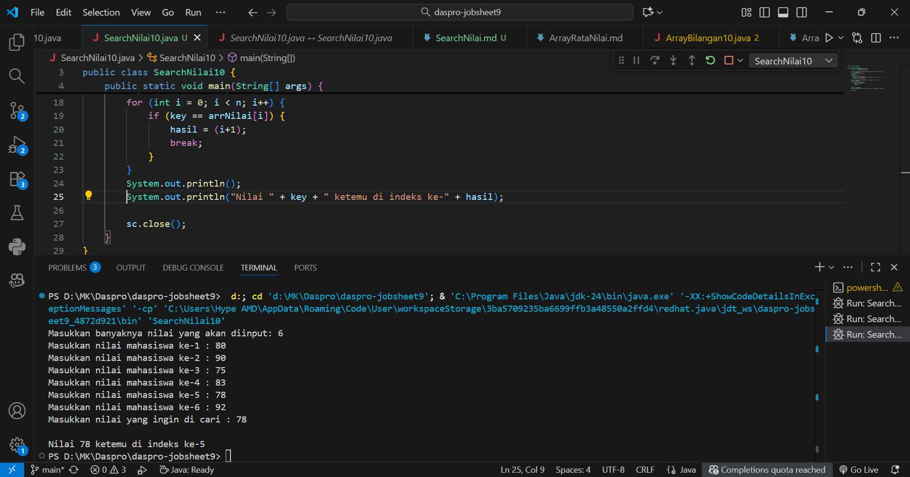

1. Jelaskan maksud dari statement break; pada baris ke-10 kode program percobaan 4 di
atas.
2. Modifikasi kode program pada percobaan 4 di atas sehingga program dapat menerima
input berupa banyaknya elemen array nilai, isi array, dan sebuah nilai (key) yang ingin
dicari. Lalu cetak ke layar indeks posisi elemen dari nilai (key) yang dicari. Contoh hasil
program:
3. Modifikasi program pada percobaan 4 di atas, sehingga program akan memberikan pesan
"Nilai yang dicari tidak ditemukan" jika nilai yang dicari (key) tidak ada di dalam array.
Contoh tampilan program sebagai berikut:

Jawaban :

1. Dalam loop (for, while, do-while): break; menghentikan eksekusi loop terdekat secara langsung dan melompat ke pernyataan setelah loop.
2. 
3. Done.